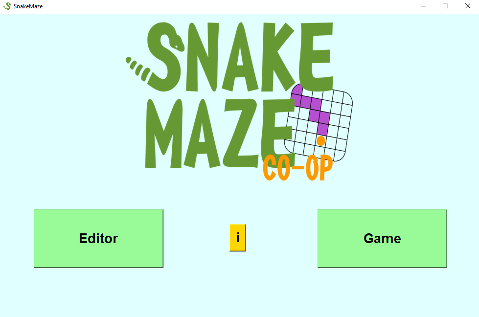
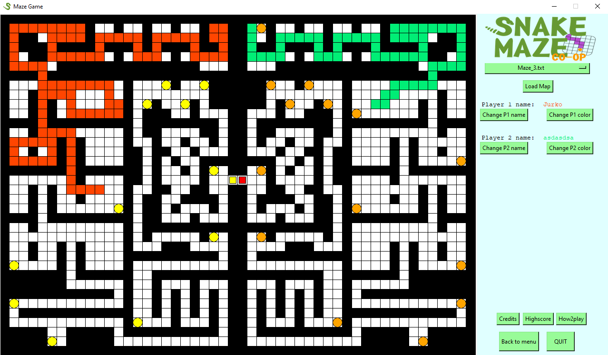

# Snake maze game for 2 players

Goal of each player is to navigate trough the maze without hitting wall while collecting all points and reaching end before other player does!

## Info about the game

Game is written purely in python using Tkinter and PIL. Game uses MVC pattern.

### Game mechanics

Here is list of features that game offers 

> - 2 player gameplay - Players control their snakes by WASD and arrows
> - Customizable colors of snakes and player names
> - Loading different mazes
> - Tracking high score for each maze 
> - Editor of maps thatis offering creation of new maps and modification of already created maps

